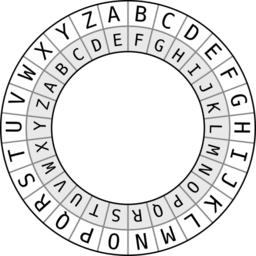
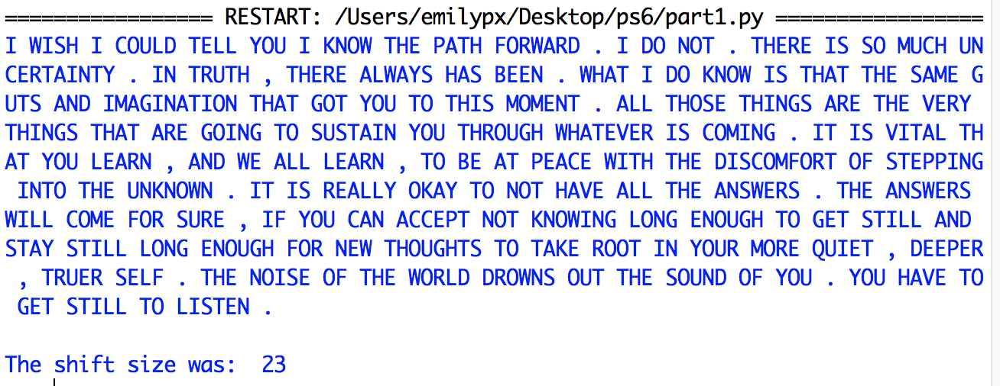
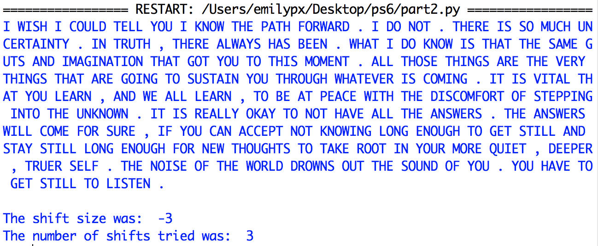

# Problem Set 6

### Due Monday, October 24, 2022, at 11:59pm EDT

For this problem set, you will submit to Canvas **a single .zip file**. Detailed instructions for what the .zip file should contain are at the end of this problem set. Note that if you do not submit the files as specified here, there will be a major deduction in your grade for this assignment. Following directions to the letter is a crucial skill for computer programming.

**Structure:** We now have a new component to our programs: **global variables**! Your programs should all have the following format: import statements (if necessary); the global variables (if there are any); then function definitions (if there are any); then a `main()` function that gets the ball rolling and calls the functions you defined (if any); and finally outide all other functions, the call to `main()`.

**Valid code:** As of ps5, I  expect you to submit code that runs to completion without errors. **Programs that produce errors when we run them will receive a grade of 0.** If you cannot get your code to run without errors, you should either post to Slack the exact error and a screenshot of the snippet of code causing the error, or come to office hours so that we can help you fix it. If it's too late to get help (e.g., 11pm on the day it's due), comment out code until your program runs without errors, and indicate in the comments where and why you commented out that code. Programs with partial code will receive partial credit.

**Comments:** Two points will be deducted if you provide no or minimal comments, and 1 point will be deducted if you have sufficient comments but they do not conform to the requirements outlined in PS5.

**Folders:** Make sure your programs and your files are all in the same folder. If you like, you can just download this whole directory to your Desktop. Do not keep any folders for this class in Downloads, as this may prevent you from reading from and writing to files, which is necessary for this problem set.

**Libraries and modules**: The only module you can import is `sys`.

**Honor pledge**: And, as always, in every program, the first four lines (comments) should be your honor pledge.

---

## Part 1: Caesar cipher: Brute force
In this program, `part1.py`, you will write a program to decode messages written using a [Caesar cipher](https://en.wikipedia.org/wiki/Caesar_cipher). 

The Caesar cipher is named after Julius Caesar, who, according to Suetonius, used it to protect messages of military significance. The Caesar Cipher is a type of substitution cipher in which each letter in a text is replaced by a letter some fixed number of positions down the alphabet. For example, with a right shift of 4, A would be replaced by E, B would become F, and so on until V becomes Z; when the end of the alphabet is reached, the cipher wraps around to the front of the alphabet, so W would be replaced by A, X by B, Y by C, and Z by D. In the diagram below, the outside ring contains the original letters, and the inside ring contains the corresponding encoded letters, with a shift of 4.

The Caesar cipher is a very popular thing to assign as a problem set for CS1 so you will find lots of solutions on the internet. The only acceptable solution for this class will be one that conforms to the the specific requirements stated in this problem set description, below. **In particular, you cannot use the Python `chr()` and `ord()` or the `translate()` and `maketrans()` string functions.**

For this program, you will use brute force to try to decode an encoded messages. I have given you some starter code, which you'll find in the `part1.py` file in this directory. The information here is included (with different wording) in the comments in the code. **Keep all of your files in the same folder!**

**Reminder:** start by opening `part1.py`. You will add to the code that is in that file to complete Part 1. You do not need to create your own `part1.py` file.

### Global Variables
* `alphabet`: a string set to `ABCDEFGHIJKLMNOPQRSTUVWXYZ`.
*  `englishwords`: a set containing the top 2000 words in English, which I populate for you.
*  `alpha2num`: a dictionary that you will populate in one of the functions below.

### Functions
* `setenglishdictionary()`: Populates `englishwords`. **You do not need to modify this function**.

* `setalpha2num()`: This void function populates the `alpha2num` global variable. You will write this code. For each letter in `alphabet` you will make an entry in `alpha2num` that maps that letter to its corresponding index in `alphabet` (e.g., `"A":0`, `"B":1`). Use a `for` loop.

* `decode(shiftsize, text)`: This function decodes a text by shifting each character by some shift size. It takes two arguments: (1) `shiftsize` (i.e., the amount to shift the alphabet) and (2) `text` (i.e., the text you want to decode). It should loop through the input text, and for each character, it should figure out what the replacement character is using `shiftsize` and the global variables `alphabet` and `alpha2num`. The challenges here are: (1) how to make sure that you don't try to look up punctuation marks in `alpha2num` since punctuation is unaffected by the cipher *(hint: check to make sure each character is in `alphabet`)*; and (2) how to wrap over the end of the alphabet *(huge hint: experiment with the modulus operator)*. This function should **return the shifted text as a string**.

* `checkgoodness(text)`: This boolean function takes a text, splits it into words, then looks each word up in the global variable `englishwords`. It keeps track of how many of the words in the text are real words that appear in `englishwords`. If more than 1/3 of the words in the text appear in `englishwords`, **then it should return `True`. Otherwise, it should return `False`**.

* `solvethecipher(text)`: Start with a shift size of 1, use that shift size to get the decoding of `text` from `decode()`, and submit that decoding to `checkgoodness()`. If `checkgoodness()` returns `True`, you have found the right shift size and decoding; otherwise if `checkgoodness()` returns false, increment the shift size by 1 and try again. Keep increasing the shift size until you find an encoding that passes the `checkgoodness()` test. When you do, **return the shift size and the decoded text**. 

### `main()` function
I have written the `main()` function for you! You will probably want to modify it as you are developing your code, but make sure to return it back to its original form before you turn in the problem set.

### Practice Texts
I have included 3 encoded texts for you to experiment with. Be sure that I can run your program on all three texts.

### Example Output
Here's what I expect to see as your output when you provide `encoded-message1.txt` as the command line argument. (Note that you can report a positive shift size or a negative shift size. A shift size of 23 is the same as a shift size of -3.)

## Part 2: Caesar cipher: More efficient decoding

In the last part, you used brute force to solve the Caesar cipher. In this part, you will try to solve the problem more efficiently. Get started by making a copy of `part1.py` called `part2.py`. Then make the following adjustments:

* Write a function called `getfrequencies(text)` that first counts how many times each letter from `alphabet` appears in the text using a for loop. (*Reminder: do not import additional libraries!*). Then it runs another for loop to calculate the relative frequency of each letter in the text (i.e., the number of times it appears in the text divided by how many letters there are in total in the text). It **returns a list of tuples where each tuple has as its first element the letter and as its second element the letter's relative frequency**. The list of tuples should be sorted by the second element. If you call the list `freqlist`, you can sort it with this line of code: `freqlist.sort(reverse=True, key=lambda x:x[1])`.

* Rewrite `solvethecipher(text)` as follows. Recall that the most frequent letter English texts is `E`. Therefore, one of the most frequent letters in the encoded text is likely to be `E`. Instead of trying every possible shift size as you did in Part 1, you will strategically choose the shift size that will map the most frequent character in the encoded text to `E`, and then submit that to `checkgoodness()`. If `checkgoodnes()` returns false, choose the shift size that will map the second most frequent character in the encoded text to `E`, and submit to `checkgoodness()`. Keep doing this until `checkgoodness()` returns `True`, then **return the encoded text, the shift size, and the number of shifts you had to try before getting a solution**.

* Update the `main()` method so that you save out three variables when you call `solvethecipher(text)`, since `solvethecipher()` now returns three values. In addition, update `main()` to print out the decoded text, the shift size, and the number of shifts you had to try before getting a solution.

Here's what I expect to see as your output when you provide `encoded-message1.txt` as the command line argument. (Again, you can report a positive shift size or a negative shift size. A shift size of 23 is the same as a shift size of -3.)

---

## What to turn in
If you haven't already, create a `ps6` folder. In your `p6` folder, put both your Python programs in the folder,  zip the folder, and upload the `ps6.zip` file you created to Canvas. 

### This problem set is due Monday, October 24, 2022, at 11:59pm EDT

